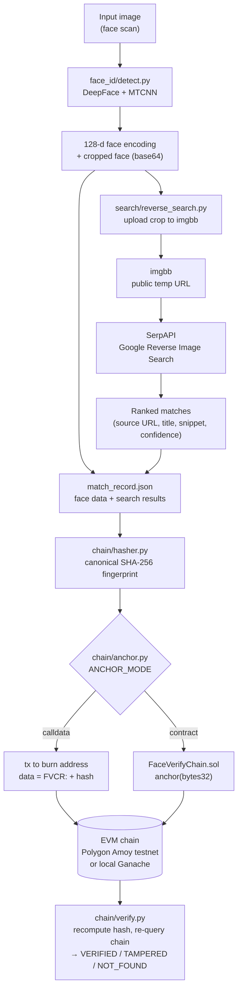

# face-verify-chain

End-to-end pipeline: **face scan → web/social-media search → blockchain verification.**

1. **Face identification** — detects a face in an input image and extracts a 128-d embedding (`face_id/detect.py`, DeepFace/Facenet).
2. **Web/social search** — uploads the face crop and runs a real Google Reverse Image Search via SerpAPI to find a matching social media post / web page (`search/reverse_search.py`). This is a live API call, not a hardcoded result.
3. **Blockchain verification** — computes a canonical SHA-256 fingerprint of the match record and anchors it on an EVM chain, then re-queries the chain to prove the record is unmodified (`chain/hasher.py`, `chain/anchor.py`, `chain/verify.py`).

---

## Pipeline shape

```
Face scan (image)
   → face_id.detect          detect + 128-d encode
   → search.reverse_search   SerpAPI reverse image search (real web/social search)
   → chain.hasher            SHA-256 of the canonical match record
   → chain.anchor            write hash on-chain (Polygon Amoy testnet / local Ganache / any EVM)
   → chain.verify            re-query chain → VERIFIED / TAMPERED / NOT FOUND
```

Every run appends a record to `match_record.json` with the face data, the search results, and (once anchored) the on-chain tx hash / block number.

---

## Which blockchain

**Ethereum-compatible (EVM) chain via `web3.py`.** Configurable, no vendor lock-in — demonstrated on **Polygon Amoy** (public testnet), also runs against a local chain for offline dev:

| `CHAIN_BACKEND` | Network | Notes |
|---|---|---|
| `custom` | Polygon Amoy testnet (or any EVM RPC) | **What we demo with.** Public, permanent, independently verifiable on [PolygonScan](https://amoy.polygonscan.com) — no trust in this repo required. Needs a funded testnet wallet (free faucet, see below). |
| `ganache` (default if unset) | Local Ganache | Free, instant, no real funds — convenient for offline dev, but state resets when Ganache restarts and only you can see it. |

Example verified transaction from our own test run: [`0x3e2de895...e727b40` on Amoy](https://amoy.polygonscan.com/tx/0x3e2de8951a7bc71542ec157652a48fd2105f5e876ab1c544320696936e727b40) — the calldata field holds our record's SHA-256 hash.

Two anchoring modes (`ANCHOR_MODE`):
- **`calldata`** (default) — the hash is embedded directly in a transaction's calldata to a burn address. No contract deployment needed; cheapest option.
- **`contract`** — calls `anchor(bytes32)` on the included `contracts/FaceVerifyChain.sol` contract, which stores `{timestamp, submitter}` per hash and exposes `verify(bytes32)`. Deploy it first with `contracts/deploy.py`.

Verification (`chain/verify.py`) recomputes the hash from the current JSON record and checks it against the chain — matching hash + found on-chain = `VERIFIED`; hash present under a different record = `TAMPERED`; nothing found = `NOT_FOUND`.

---

## Project structure

```
face-verify-chain/
├── face_id/
│   └── detect.py             # Face detection & 128-d encoding (DeepFace)
├── search/
│   └── reverse_search.py     # Reverse image search via SerpAPI + imgbb
├── chain/
│   ├── hasher.py              # Canonical SHA-256 of a match record
│   ├── anchor.py               # Anchor hash on-chain (calldata or contract)
│   └── verify.py               # Re-query chain, print VERIFIED/TAMPERED/NOT_FOUND
├── contracts/
│   ├── FaceVerifyChain.sol    # Optional on-chain anchor/verify contract
│   └── deploy.py                # Compile + deploy the contract
├── samples/                   # Sample image + downloader helper
├── tests/
│   └── test_hasher.py          # Hasher unit tests (no external deps needed)
├── main.py                    # Full pipeline CLI entry point
├── demo.py                    # Presentation-friendly run (degrades gracefully if keys/RPC missing)
├── requirements.txt
└── .env.example                # Copy to .env and fill in your keys
```

---

## Setup

### 1. Clone & create a virtual environment

```bash
git clone <repo-url> face-verify-chain
cd face-verify-chain
python -m venv .venv
source .venv/bin/activate   # Windows: .venv\Scripts\activate
```

### 2. Install dependencies

```bash
pip install -r requirements.txt
```

### 3. Add your API keys (`.env`)

```bash
cp .env.example .env
```

Then open `.env` in an editor and paste your real keys after the `=` signs — **never** put them in code, commit messages, or `.env.example`. `.env` is already listed in `.gitignore`, so `git status` should never show it as a tracked/staged file; double-check with `git status` before any commit.

Keys needed:

| Variable | Where to get it | Required for |
|---|---|---|
| `SERPAPI_KEY` | [serpapi.com](https://serpapi.com) (free tier: 100 searches/mo) | Step 2 — reverse image search |
| `IMGBB_KEY` | [api.imgbb.com](https://api.imgbb.com) (free) | Step 2 — temporary public hosting of the face crop so Google can fetch it |
| `CHAIN_RPC_URL` / `CHAIN_PRIVATE_KEY` | Only for the `custom` backend (e.g. Amoy) | Step 4 — on-chain anchoring |

**To anchor on Polygon Amoy (public testnet, recommended):**
```bash
CHAIN_BACKEND=custom
CHAIN_RPC_URL=https://polygon-amoy-bor-rpc.publicnode.com
CHAIN_PRIVATE_KEY=<a throwaway testnet wallet's private key — never a real-funds wallet>
```
Fund that wallet's address for free at https://faucet.polygon.technology (select "Amoy").

**To anchor locally instead (no faucet, no public proof):** leave `CHAIN_BACKEND` unset (defaults to `ganache`) and run:
```bash
npx ganache
```

### 4. Get a test image

```bash
python samples/generate_sample.py
# or supply your own: python main.py path/to/your_photo.jpg
```

---

## Usage

```bash
# Full pipeline: detect → search → hash → anchor → verify
python main.py samples/sample_face.jpg

# Face detection only (no API keys, no chain needed)
python main.py samples/sample_face.jpg --dry-run

# Detect + search, skip blockchain steps
python main.py samples/sample_face.jpg --skip-chain

# Re-run chain steps on an already-saved record
python main.py samples/sample_face.jpg --skip-search --output match_record.json

# More search results / a different embedding model
python main.py samples/sample_face.jpg --max-results 10 --model VGG-Face
```

Standalone chain tools:

```bash
python -m chain.anchor match_record.json     # anchor the most recent record
python -m chain.verify match_record.json     # re-verify it against the chain
python contracts/deploy.py                   # deploy FaceVerifyChain.sol (contract mode only)
```

Presentation run (won't crash if a key/RPC is missing — simulates that step instead):

```bash
python demo.py
```

---

## Output: `match_record.json`

Each run appends a record (JSON array). Example, abbreviated:

```json
{
  "pipeline_status": "success",
  "image_path": "samples/sample_face.jpg",
  "face_detection": { "num_faces_in_image": 1, "bounding_box": { "...": "..." }, "encoding_dim": 128 },
  "reverse_search": { "num_matches": 1, "matches": [ { "source_url": "https://...", "confidence_score": 1.0 } ] },
  "top_match": { "source_url": "https://...", "confidence_score": 1.0, "timestamp": "..." },
  "chain_anchor": { "tx_hash": "0x...", "block_number": 123, "chain_backend": "custom" },
  "chain_verify": { "status": "VERIFIED", "anchored_at_iso": "..." }
}
```

---

## Tests

```bash
python -m pytest tests/ -v
# or, no pytest needed:
python tests/test_hasher.py
```

`tests/test_hasher.py` covers hash determinism, canonical-field selection, and tamper sensitivity without requiring DeepFace, web3, or a running chain.

---

## Known limitations

- **Reverse image search quality depends on SerpAPI/Google's index.** A cropped face, especially a private individual's, may return zero or low-confidence matches — the pipeline reports this honestly (`search_error`, `num_matches: 0`) rather than fabricating a result.
- **`imgbb` upload is temporary and public.** The face crop is hosted for up to 10 minutes so Google can fetch it; anyone with the URL during that window could view it.
- **`calldata` anchor mode has no built-in ownership/access control** — anyone can anchor a hash to the burn address. `contract` mode records a `submitter` address per hash if that matters for your use case.
- **The full 128-d face encoding is stored in `match_record.json` and hashed record.** Treat that file as sensitive biometric data; it is not encrypted at rest.
- **No liveness/anti-spoofing check** — a photo of a photo would be processed the same as a live capture.
- **Ganache state is ephemeral** — restarting it wipes all anchored hashes; use Amoy (or another persistent chain) for anything you need to survive a restart or show as independently verifiable proof.
- **Confidence scoring is a simple rank-based heuristic**, not a calibrated similarity score.

---

## Architecture



Two independent trust boundaries meet at the hash: the **search step** proves *what* was found on the web (a real, live-queried post), and the **chain step** proves *that record hasn't changed since* — anyone holding `match_record.json` plus the tx hash can independently recompute the SHA-256 and check it against the public chain, without trusting this codebase at all.
